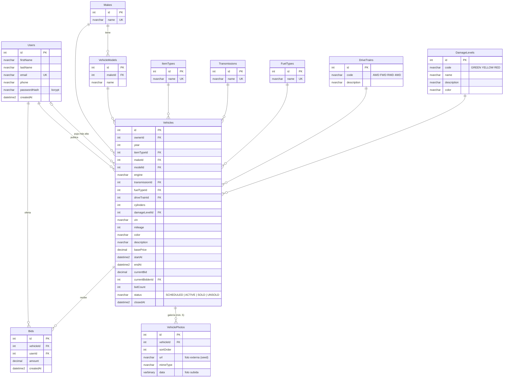

# Modelo de base de datos (SQL Server)

- `schema.sql`: script DDL completo para crear las tablas en SQL Server / Azure SQL (generado desde `backend/prisma/schema.prisma`).
- La fuente de verdad es `backend/prisma/schema.prisma`; las migraciones versionadas están en `backend/prisma/migrations/`.
- Para regenerar el script: `cd backend && npm run db:sql`.

## Diagrama entidad-relación

## Notas de diseño

- **Catálogos normalizados** (marcas, modelos, tipos, transmisiones, combustibles, trenes de manejo y niveles de daño) para que los filtros del inventario sean consultas por llave foránea indexada.
- `Vehicles.currentBid`, `currentBidderId` y `bidCount` son una desnormalización de la tabla `Bids` para leer el estado de la subasta en una sola fila; se actualizan dentro de la misma transacción que inserta la puja, con control optimista sobre `bidCount`.
- `currentBidderId` **nunca** se expone por la API pública: solo se usa en el servidor para calcular el indicador "¡Vas ganando!" / "Tu oferta ha sido superada" de cada usuario.
- Las fotos subidas se guardan como `VARBINARY(MAX)` para que el despliegue no dependa de un almacenamiento de archivos externo; las del seed son URLs.
